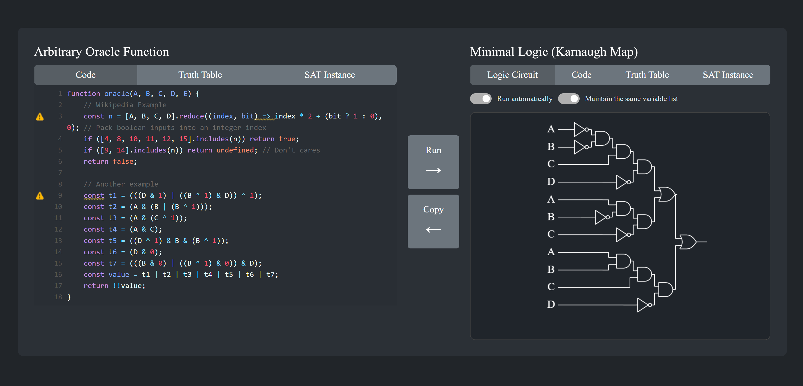

# Boolean Expression Minimization

```console
Canonical form: A standard representation of Boolean expressions used to demonstrate equivalence between different forms.
```

This browser-based tool simplifies Boolean expressions by converting them into their canonical form. It accepts a JavaScript oracle function, truth table, or DIMACS SAT instance (CNF or DNF) and produces a minimized JavaScript function, truth table, DIMACS DNF instance, or logic circuit diagram.



Minimization uses the Quine-McCluskey algorithm, which is NP-complete with exponential time complexity.

## Logic Circuit Renderer

A minimal rendering library (`logicCircuitRenderer.js`) is included for drawing schematic diagrams. For example usage, see `logicCircuitRenderer_example.html`.
